## 一、Hibernate查询方式

### 1.1 对象导航查询

1. 根据id查询客户，再根据查询到的联系人查询里面的所有联系人。

   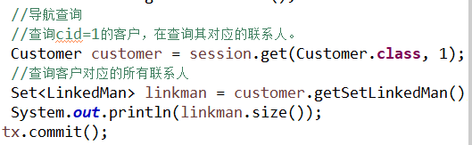


### 1.2 OID查询

1. 根据id查询某一条记录，返回对象。

   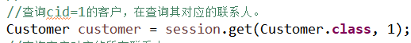

### 1.3 HQL查询

> hql对象操作的是实体类，以及实体类的属性，普通sql操作的是表和表字段

#### 1.3.1 HQL单表查询

- **查询所有**
  - 查询所有客户的记录
    - 查询所有：from+实体类的名称

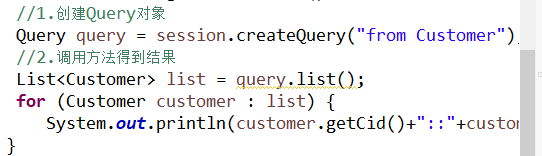

- **条件查询**

  - hql条件查询语句写法

    - 精确条件查询：from+实体类名称+where+实体类属性名称=?+and +实体类名称=？

    - 模糊条件查询：from+实体类名称+where+实体类属性名称 +like ?

  - 条件查询：

    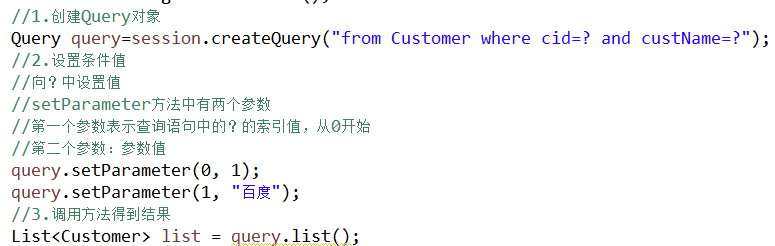

  - 模糊查询

  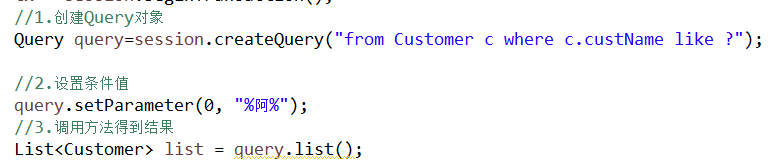

- **排序查询**

  - hql排序语句写法

    - from+实体类名称+order by+ 实体类属性名称+asc(升序)/desc(降序)

    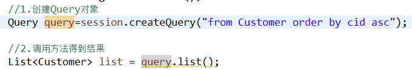

  - 应用场景

- **分页查询**

  - MySQL实现分页查询
    - 使用关键字limit实现

  ```sql
  select * from t_customer limit 0,3
  ```

  - 在hql中实现分页查询
    - hql操作，不支持limit关键字。在hibernate的Query对象中封装了两个方法来实现分页操作。

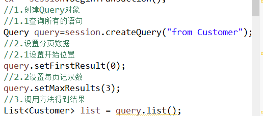

- 投影查询

  - 投影查询，查询的不是所有字段的值，而是部分字段的值。

    - 投影查询hql语句的写法。

      select+实体类属性名称1+，...+实体类属性名称n from+实体类名称

  > select 后面不能写*，不支持

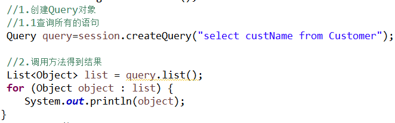

- 聚集函数使用

  - 常用的聚集函数
    - count、sum、avg、max、min
  - hql聚集函数语句写法
    - 查询表记录数

  ```sql
  select count(*) from Customer
  ```

  - 使用hql查询函数返回的结果为object类型，将object类型的数据不能直接转化为int类型如下所示：提示类型转换异常

  
  - 正确的做法
    - 首先将类型转化为Long类型，然后再转化为int类型。

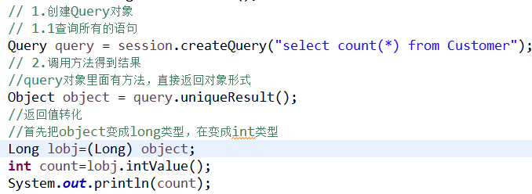

#### 1.3.2 HQL多表查询

- mysql中的多表查询

1. 内连接

```sql
select * from t_customer c,t_linkedman l where c.cid=l.clid

select * from t_customer c inner join t_linkedman l on c.cid=l.clid
```

2. 左外连接

```sql
select * from t_customer c left outer join t_linkedman l on c.cid=l.clid
```

> 左表所有，右表与左表所有有关的数据。

3. 右外连接

```sql
select * from t_customer c right outer join t_linkedman l on c.cid=l.clid
```

- HQL实现多表查询

  - Hql多表查询（以客户联系人为例）

    1. HQL内连接

    ```java
    Query query=session.createQuery("from Customer c inner join c.setLinkedMan");
    			
    			List list = query.list();
    ```

    - 返回list，list里面每部分是数组形式

    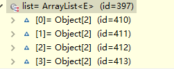

    2. HQL左外连接

    ```java
    Query query=session.createQuery("from Customer c left outer join c.setLinkedMan");
    			
    			List list = query.list();
    ```

    - 返回list，list里面每部分是数组形式

    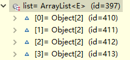

    3. HQL右外连接

    ```java
    Query query=session.createQuery("from Customer c right outer join c.setLinkedMan");
    			
    			List list = query.list();
    ```

    

    4. HQL迫切内连接(特有)

    > - 其与内连接底层实现一样
    >
    > - 区别：内连接返回list中每部分是数组，迫切内连接返回的每部分是对象

    ```java
    Query query=session.createQuery("from Customer c inner join fetch c.setLinkedMan");
    			
    			List list = query.list();
    ```

    

    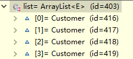

    5. HQL迫切左外连接(特有)

    ```java
    Query query=session.createQuery("from Customer c left outer join fetch c.setLinkedMan");
    			
    			List list = query.list();
    ```

    - 返回的list集合的每部分是一个对象

    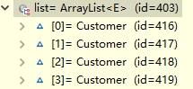


### 1.4 QBC查询

> - 使用qbc查询不用书写查询语句，调用方法就能实现相应的功能
> - qbc操作的也是实体类和属性
> - 使用qbc通过Criteria类的对象实现

- 查询所有

  ```java
  	//1.创建criteria对象
  	Criteria criteria = session.createCriteria(Customer.class);
  	//2.调用方法得到结果
  	List<Customer> list = criteria.list();
  ```

- 条件查询

  ```java 
  	// 1.创建criteria对象
  	Criteria criteria = session.createCriteria(Customer.class);
  	// 2.使用Criteria对象里面的方法设置条件
  	//使用add方法，表示设置条件值
  	//在add方法里面使用类的方法实现条件设置
  	criteria.add(Restrictions.eq("cid", 2));
  	criteria.add(Restrictions.eq("custName", "阿里巴巴"));
  	//3.调用方法得到结果
  	List<Customer> list = criteria.list();
  ```

  ```java
  	//模糊查询
  	criteria.add(Restrictions.like("custName", "%百%"));
  ```

  

- 排序查询

  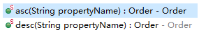

  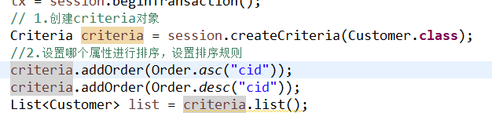

- 分页查询

  ```java
  	// 1.创建criteria对象
  	Criteria criteria = session.createCriteria(Customer.class);
  	//2.设置分页数据
  	//开始位置
  	criteria.setFirstResult(0);
  	//每页分页显示
  	criteria.setMaxResults(3);
  ```

  - **开始位置计算：（当前页-1）*每页记录数**

- 统计查询

  - 代码

    ```java
    	// 1.创建criteria对象
    	Criteria criteria = session.createCriteria(Customer.class);
    	//2.设置操作
    	criteria.setProjection(Projections.rowCount());
    	//3.调用方法得到结果
    	Object object = criteria.uniqueResult();
    	Long lobj=(Long) object;
    	int count=lobj.intValue();
    ```

- 离线查询

  - 离线：不用session对象创建Criteria对象

  - 代码演示

  ```java
  	//1.创建离线对象
  	DetachedCriteria detachedCriteria=DetachedCriteria.forClass(Customer.class);
  	//2最终执行时候需要session
  	Criteria criteria = detachedCriteria.getExecutableCriteria(session);
  	List<Customer> list = criteria.list();
  ```

  - 在web中servlet调用service，service调用dao。
    - 在dao中对数据库crud
    - 在dao中使用hibernate框架，使用时调用session里面的方法。

  > 使用场景：假如我们要在service层使用session对象，这时可以定义离线查询对象，拼出查询条件后传入到dao中。

## 二、Hibernate检索策略

### 2.1 立即查询

- 根据id，一种方法是调用get方法，一旦调用get方法就马上发送语句查询数据库

### 2.2 延迟查询

- 根据id查询，另一种方法是load方法，调用load方法不会马上发送语句查询数据，只有在取得对象里面的值时才会发送语句查询数据库

  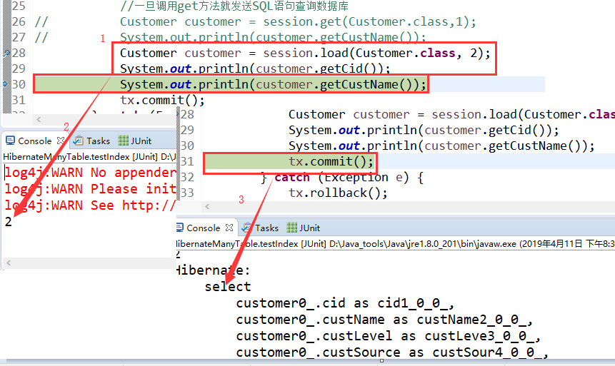

#### 2.2.1类级别延迟

- 根据id查询，调用get方法返回实体类对象，调用load()方法不会马上发送SQL语句。

#### 2.2.2 关联级别延迟

- 查询某个客户，再查询该客户的联系人，在查询联系人的过程中是否需要延迟，该过程称为关联级别的延迟。

  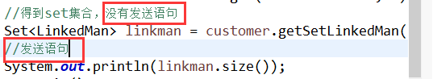

- 关联级别延迟操作

  - 修改映射配置文件

    - 在set标签上使用两个属性值

      - lazy
      - fetch

      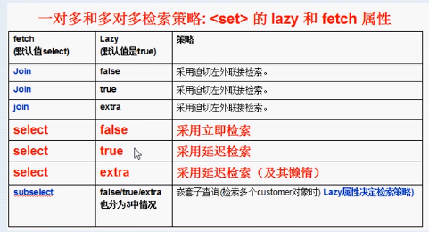

## 三、批量抓取

- 需求：得到所有客户对应的联系人

  1. 查询所有联系人，返回list集合，遍历list集合得到每一个客户，然后分别得到他们的联系人。

     > 上述方式虽然可以实现但是执行过程中要发送多次SQL语句，性能不高。

     - 代码

       ```java
       	//得到所有客戶
       	 Criteria criteria = session.createCriteria(Customer.class);
       	 List<Customer> list = criteria.list();
       	 //遍历客户得到联系人
       	 for (Customer customer : list) {
       	System.out.println(customer.getCid()+":"+customer.getCustName());
       	//得到客户对应的联系人
       	Set<LinkedMan> setLinkedMan = customer.getSetLinkedMan();
       	for (LinkedMan linkedMan : setLinkedMan) {
       		System.out.println(linkedMan.getLkm_id()+":"
                              +linkedMan.getLkm_name());
       				}
       		}
       ```

  2. 优化方案：在客户的映射文件中对set标签的batch-size进行配置

     - batch-size:值越大，发送的语句越少