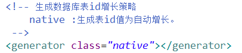
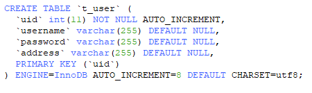
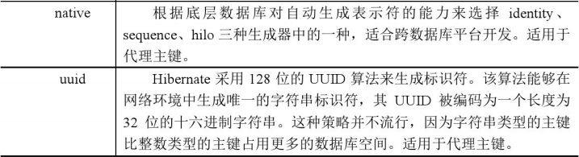
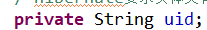
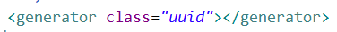
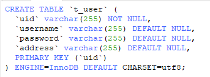

# hibernate概念和api使用

[TOC]

## 一、实体类的编写规则（重点）

1. 实体类的属性私有。

2. 私有属性使用公有的set和get方法。

3. 要求实体类中有一个属性作为唯一值。（一般使用id值）

4. 实体类属性的类型不建议使用基本数据类型，而使用基本数据类型的包装类。

   1. 八个基本数据类型对应的包装类

      - int-Integer
      - char-Character
      - 其他的都是首字母大写即可：double-Double

   2. 例：表示学生分数：int score

      1. 学生得了0分：int score=0；

      2. 如果学生没有参加考试：int score=0；该方式不能准确表示学生是否参见考试

      - 解决：使用包装类即可，Integer score=0；得分为0；
      - 表示没有参加考试：Integer score=null;

## 二、hibernate主键生成策略

1. hibernate要求实体类中有一个属性可以唯一区分不同对象，对应表的主键，主键可以有不同的生成策略。

2. hibernate主键生成策略有很多的值。

   

3. 在class属性里面有多个值

   1. native：根据使用的数据库帮助选择哪个值

      

   2. uuid：web阶段手动编写代码生成uuid值，hibernate自动生成uuid值。

   

4. 演示生成策略值是uuid

   1. 使用uuid生成策略，实体类中id属性数据类型**必须**为字符串类型

      ​	

   2. 配置部分写出uuid值
     

     

     

     

## 三、实体类操作（重点）

1. crud操作（重点）
2. 实体类对象的状态

## 四、hibernate的以及缓存

## 五、事务的操作操作

1. 事务代码规则写法（重点）

## 六、hibernate其他api（查询）（重点）