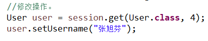
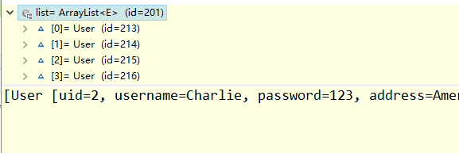

# hibernate概念和api使用

[TOC]

## 一、实体类的编写规则（重点）

1. 实体类的属性私有。

2. 私有属性使用公有的set和get方法。

3. 要求实体类中有一个属性作为唯一值。（一般使用id值）

4. 实体类属性的类型不建议使用基本数据类型，而使用基本数据类型的包装类。

   1. 八个基本数据类型对应的包装类

      - int-Integer
      - char-Character
      - 其他的都是首字母大写即可：double-Double

   2. 例：表示学生分数：int score

      1. 学生得了0分：int score=0；

      2. 如果学生没有参加考试：int score=0；该方式不能准确表示学生是否参见考试

      - 解决：使用包装类即可，Integer score=0；得分为0；
      - 表示没有参加考试：Integer score=null;

## 二、hibernate主键生成策略

1. hibernate要求实体类中有一个属性可以唯一区分不同对象，对应表的主键，主键可以有不同的生成策略。

2. hibernate主键生成策略有很多的值。

   

3. 在class属性里面有多个值

   1. native：根据使用的数据库帮助选择哪个值

      

   2. uuid：web阶段手动编写代码生成uuid值，hibernate自动生成uuid值。

   

4. 演示生成策略值是uuid

   1. 使用uuid生成策略，实体类中id属性数据类型**必须**为字符串类型

      ​	

   2. 配置部分写出uuid值
     

     

     

     

## 三、实体类操作（重点）

### 3.1crud操作（重点）

#### 3.1.1 添加操作

- 调用session的save方法实现。

​	

#### 3.1.2 根据id查询

1. 调用session对象中的get方法。

   

   

#### 3.1.3 修改操作

1. 首先查询，然后修改值

   1. 根据id查询结果。

      

      > - 也可以调用session的save方法就行修改。
      >
      > - 如果设置对象的ID属性与表中已有的ID字段值相同，调用session的sava方法时，不能执行类似修改的逻辑，而是会添加一个新的数据。（不建议）
      >
      >   
      >
      > - 如果设置实体类对象的ID值和字段中的ID值相同，执行update方法时，如果没有指定所有的字段，则只有指定字段内容会修改，其他字段均置空。（不建议）
      >
      >   

      

#### 3.1.4 删除操作

1. 调用session的delete方法

   

   

   

### 3.2实体类对象的状态（概念）

1. 实体类三种状态

   - 瞬时态：对象中没有ID值，与session也没有关联。

     

   - 持久态：对象中有ID值，与session也相关联。

     

   - 托管态：对象中有ID值，与session没有关联。

     

2. 演示操作实体类对象的方法

   1. saveOrUpdate方法：添加、修改操作。

      - 实体类是瞬时态，做添加操作

      

      - 实体类是托管态，执行修改操作

        

      - 实体类是持久态，执行修改操作  

        

## 四、hibernate的一级缓存

#### 4.1什么是缓存？

1. 数据存放到数据库中，数据库本身是一个文件系统，使用流方式操作文件效率不高。

   - 数据存放到内存中，不使用流操作，直接读取内存中的数据

   - 直接读取内存中的数据提高了数据访问的效率。

#### 4.2 Hibernate缓存

1. hibernate框架提供了很多优化方式，hibernate的缓存就是一个优化方式。
2. hibernate缓存特点
  - 第一类hibernate的一级缓存（重点掌握）
    1. hibernate一级缓存默认打开。
    2. hibernate中一级缓存具有使用范围：session范围。从session创建到session关闭。
    3. hibernate一级缓存中，存储数据必须是持久态的数据。
  - 第二类 hibernate的二级缓存
    1. 目前已经不使用了，替代技术Redis。
    2. 二级缓存默认关闭。
    3. 二级缓存使用范围：整个项目的范围。（sessionFactory范围）
#### 4.3 验证一级缓存存在

1. 验证方式
  1. 首先根据uid=1查询，返回对象。

  2. 再次根据uid=1查询，返回对象。
    

   
    
    - 第一步执行get方法之后，发送SQL语句查询数据库
    - 第二步执行get方法之后，没有发送SQL语句，查询一级缓存中的内容

#### 4.4 一级缓存执行过程

1. 文字描述
   - 首先在一级缓存中查找数据，如果没有查询数据库，返回对象（持久态对象）；同时将查询到的对象放入一级缓存。若一级缓存中有，直接返回对象。
   - 以后执行上述相同过程。

#### 4.5 Hibernate一级缓存特性

1. 持久态自动更新数据库

   ​	

2. 执行过程（了解）

   - 根据ID查询数据放入一级缓存，同时在快照区创建备份。
   - 设置对象的属性后，将修改后的内容放入一级缓存中。
   - 进行事务提交时，比较一级缓存中的内容和快照区备份，相同修改数据库数据，否则不执行更新数据库。

## 五、Hibernate事务的操作

#### 5.1 事务相关概念

1. 什么是事务？

2. 事务特性

3. 不考虑隔离性产生的问题

   - 脏读

   - 幻读

   - 不可重复度

4. 设置事务隔离级别

   - MySQL默认隔离级别：repeatable read

#### 5.2 事务代码规范写法

1. 代码结构

   ```java
   //事务的规范写法
   	@Test
   	public void testTranscation() {
   		SessionFactory sessionFactory=null;
   		Session session=null;
   		Transaction tx=null;
   		try {
   			 sessionFactory = HibernateUtils.getSessionFactory();
   			 session= sessionFactory.openSession();
   			//开启事务
   			tx = session.beginTransaction();
   			User user = new User();			user.setUsername("老王");
   			user.setPassword("250");
   			user.setAddress("中国");
   			//添加数据
   			session.save(user);
   			int i=10/0;
   			//提交事务
   			tx.commit();			
   		} catch (Exception e) {
   			e.printStackTrace();
   			//事务回滚
   			tx.rollback();
   		}finally {
   			//事务关闭
   			sessionFactory.close();
   			session.close();
   		}
   	} 
   ```

####  5.3 Hibernate绑定session

1. session类似jdbc的connection，在web中有：threadLocal（线程绑定）

2. 帮助实现了与本地线程绑定session

3. 获取与本地线程绑定的session

   - 在hibernate核心配置文件中配置

     ```java
     <!-- 绑定线程session的配置 -->
     		<property name="hibernate.current_session_context_class">thread</property>
     ```

   - 调用sessionFactory中的方法

     ```java
     //提供返回与本地线程绑定的session方法
     	public static Session getSession() {
     		return sessionFactory.getCurrentSession();
     	}
     ```

4. <font color=red>获取与本地线程绑定的session时候，关闭session会报错。程序结束后session会自动关闭，不需要手动关闭。</font>

   

### 六、hibernate其他api（查询）（重点）

#### 6.1 Query对象

1. 使用query对象，不需要写SQL语句，但是需要写hql语句

   - hql：hibernate query langue，hibernate提供的查询语句，该语句与普通SQL语句很相似
   - hql和SQL语句区别
     - SQL语句操作表和表中的字段
     - hql操作实体类和属性

2. 查询所有hql语句

   - from [实体类的名称]

3. Query对象的使用

   1. 创建Query对象
   2. 调用Query对象的方法。

   ```java
   	//创建Query对象
   	Query query = session.createQuery("from User");
   	//调用Query对象的方法
   	List<User> list = query.list();
   	for (User user : list) {
   		System.out.println(user);
   	}
   ```

   

#### 6.2 Criteria 对象

1. 使用该对象也能实现查询操作，使用该对象，不需要写语句，直接调用方法实现。

   1. 创建对象
   2. 调用对象的方法。

   ```java
   //创建Criteria对象
   			Criteria createCriteria = session.createCriteria(User.class);
   			//调用Criteria对象的方法
   			List<User> list = createCriteria.list();
   ```

   

#### 6.3 SQLQuery对象

1. 使用hibernate时，调用底层SQL语句。

2. 实现过程

   1. 创建对象

   2. 调用对象的方法

      ```java
      //创建SQLQuery对象
      			SQLQuery createSQLQuery = session.createSQLQuery("select * from t_user");
      			//调用SQLQuery对象的方法
      			//返回的list集合，默认里面每部分是数组
      			List<Object[]> list = createSQLQuery.list();
      			for (Object[] objects : list) {
      				System.out.println(Arrays.toString(objects));
      			}
      ```

      - 返回的list集合每部分是一个数组。

      

      - 使返回的list集合中的每部分是一个对象。

        ```java
        //创建SQLQuery对象
        			SQLQuery createSQLQuery = session.createSQLQuery("select * from t_user");
        			//调用SQLQuery对象的方法
        			//返回的list集合，每部分是一个对象
        			createSQLQuery.addEntity(User.class);
        			List<User> list = createSQLQuery.list();
        ```

        

