# hibernate配置一对多和多对多

[TOC]

## 一、表间关系

1. 一对多

   1. 分类和商品关系，一个分类有多个商品，一个商品只能属于一个分类。

   2. 客户和联系人是一对多关系

      - 客户：与公司有业务往来，百度、新浪、腾讯。

      - 联系人：公司里面的员工，百度里面的员工，联系员工。

        > 公司和公司员工的关系

      - 客户是一，联系人是多

      - 一个客户里面有多个联系人，一个联系人只能属于一个客户。

   3. 一对多建表：通过外键建立关系。

      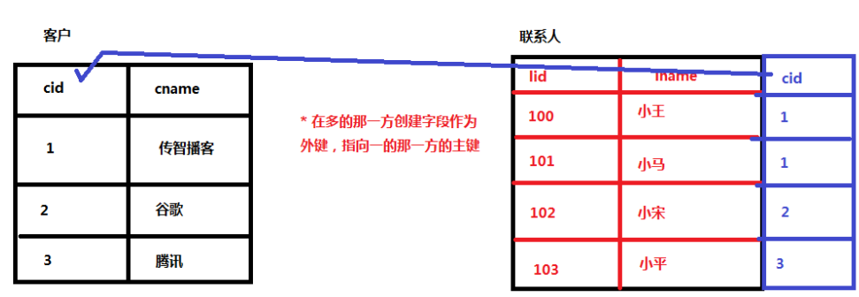

2. 多对多

   1. 订单和商品，一个订单可以有多个商品，一个商品属于多个订单。

   2. 用户和角色多对多关系

      - 用户：小王、小徐、小刘
      - 角色：总经理、秘书、司机、保安
      - 一个用户有多个角色，一个角色可以是多个用户。

   3. 多对多建表：建立第三张表

      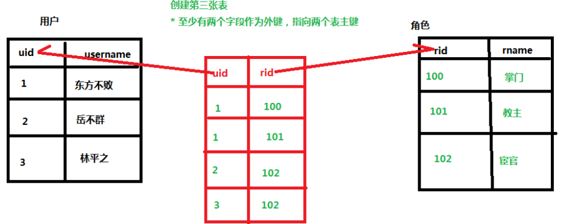

3. 一对一（了解）

   1. 一夫一妻制。

## 二、Hibernate的一对多操作（重点）

### 2.1 一对多映射配置

以客户联系人为例：客户是一，联系人是多。

**第一步**：创建实体类，客户和联系人。

**第二步**：让两个实体类相互表示。

- 在客户实体类中表示多个联系人。

  - 一个客户中有多个联系人。

  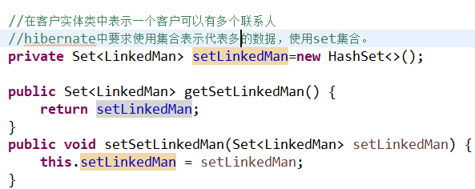

  - 在联系人 实体类中配置联系人与客户的对应关系。

  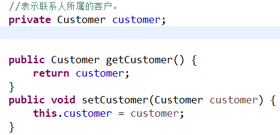

**第三步**：配置映射关系

1. 一般一个实体类对应一个映射文件。

2. 配置基本映射关系

3. 在映射文件中，配置一对多映射关系。

   - 在客户映射文件中，表示所有联系人

     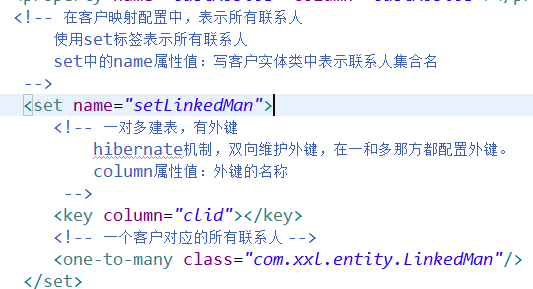

   - 在联系人映射文件中，表示所属客户。

     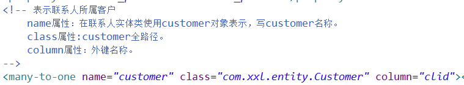

第四步：创建核心配置文件，把映射文件引入到核心配置文件中。

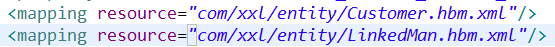

测试：

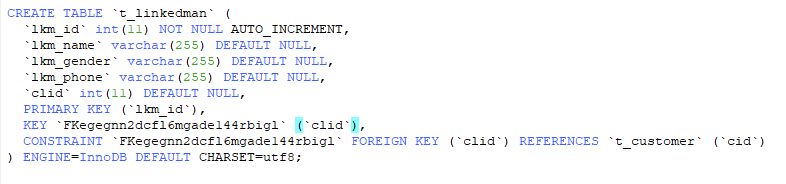

- 在联系人实体类中表示所属客户。
  - 一个联系人只能属于一个客户。

### 2.2一对多级联操作

级联操作

1. 级联保存

   添加一个客户，为一个客户添加多个联系人

2. 级联删除

   删除一个客户，客户中的所有联系人也删除。

#### 2.2.1 一对多级联保存

1. 添加客户，为这个客户添加一个联系人。
   - 复杂写法

   ```java
   @Test
   public void testAddDemo1() {
   	SessionFactory sessionFactory =null;
   	Session session=null;
   	Transaction tx=null;
   	try {
   		//创建sessionFactory对象
   		sessionFactory= HibernateUtils.getSessionFactory();
   		//创建session对象。
   		session= sessionFactory.openSession();
   		//创建事务对象。
   		tx = session.beginTransaction();
   		//开启事务
   		tx.begin();
   		//业务逻辑书写
   		//1.创建客户联系人对象。
   		Customer customer = new Customer();
   		customer.setCustName("xuxueli");
   		customer.setCustLevel("vip");
   		customer.setCustSource("student");
   		customer.setCustPhone("119");
   		customer.setCustMobile("18987763782");
   		
   		LinkedMan linkedMan = new LinkedMan();
   		linkedMan.setLkm_name("Charile");
   		linkedMan.setLkm_gender("man");
   		linkedMan.setLkm_phone("911");
   		//2.客户联系人关系建立
   		//2.1客户中表示联系人
   		//把联系人对象放到客户的set集合中
   		customer.getSetLinkedMan().add(linkedMan);
   		//2.2把客户对象放到联系人中。
   		linkedMan.setCustomer(customer);
   		
   		//3保存到数据库中
   		session.save(linkedMan);
   		session.save(customer);
   		
   		//提交事务
   		tx.commit();
   	} catch (Exception e) {
   		tx.rollback();
   	}finally {
   		session.close();			sessionFactory.close();
   	}
   }
   ```

   


   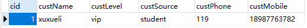

   ​	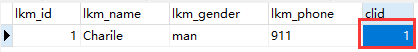

   - 简化写法

   >  一般地：根据客户添加联系人。 

   1. 第一步：在客户映射文件中配置。

      在客户映射文件中的set标签中配置。

      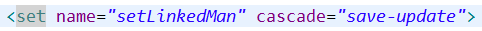
2. 第二步：创建客户联系人对象，只需将联系人放入客户中，最终保存客户即可。

   > 注意save-update中的<font color=red>“-“，不是”_"</font>

   ```java
   @Test
   	public void testAddDemo2() {
   		SessionFactory sessionFactory=null;
   		Session session=null;
   		Transaction tx=null;
   		try {
   			//创建sessionFactory对象
   			sessionFactory = HibernateUtils.getSessionFactory();
   			//创建session对象。
   			session= sessionFactory.openSession();
   			//创建事务对象。
   			tx = session.beginTransaction();
   			//业务逻辑书写
   			//1.创建客户联系人对象。
   			Customer customer = new Customer();
   			customer.setCustName("Alibaba");
   			customer.setCustLevel("vip");
   			customer.setCustSource("company");
   			customer.setCustPhone("119");
   			customer.setCustMobile("18987763782");
   			
   			LinkedMan linkedMan = new LinkedMan();
   			linkedMan.setLkm_name("Jack");
   			linkedMan.setLkm_gender("man");
   			linkedMan.setLkm_phone("911");
   			linkedMan.setCustomer(customer);
   			
   			//2把联系人放入客户中
   			customer.getSetLinkedMan().add(linkedMan);
   			//3保存客户
   			session.save(customer);
   			
   			//提交事务
   			tx.commit();
   			} catch (Exception e) {
   			tx.rollback();
   			}finally {
   				//session与本地线程绑定了所以不需要手动关闭。
   //				session.close();
   				sessionFactory.close();
   			}
   }
   ```

   > Ps:如果在程序调试的过程中无法获得sessionFactory对象，说明配置文件中一定写错了。


#### 2.2.2 一对多级联删除

1. 删除某个客户，并将客户中联系人也删除。

2. 具体实现

   1. 第一步：在客户映射文件中的set标签，进行配置

      - 配置set标签中cascade属性值为：delete

        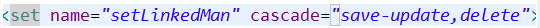

   2. 第二步：在代码中直接删除客户

      1. 根据id查询到对象，调用session的delete方法删除对象。

         

   3. 执行过程

      1. 根据id查询客户

         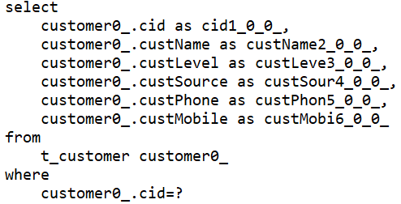

      2. 根据外键查询联系人

         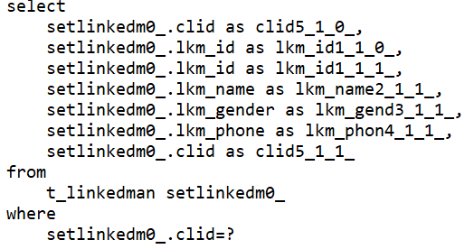

      3. 将联系人的外键设置为null

         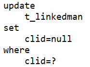

      4. 删除联系人和客户

         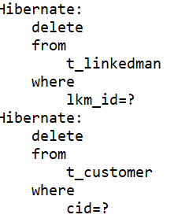

#### 2.2.3 一对多的级联修改

