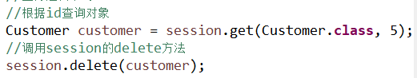

# hibernate配置一对多和多对多

[TOC]

## 一、表间关系

1. 一对多

   1. 分类和商品关系，一个分类有多个商品，一个商品只能属于一个分类。

   2. 客户和联系人是一对多关系

      - 客户：与公司有业务往来，百度、新浪、腾讯。

      - 联系人：公司里面的员工，百度里面的员工，联系员工。

        > 公司和公司员工的关系

      - 客户是一，联系人是多

      - 一个客户里面有多个联系人，一个联系人只能属于一个客户。

   3. 一对多建表：通过外键建立关系。

      

2. 多对多

   1. 订单和商品，一个订单可以有多个商品，一个商品属于多个订单。

   2. 用户和角色多对多关系

      - 用户：小王、小徐、小刘
      - 角色：总经理、秘书、司机、保安
      - 一个用户有多个角色，一个角色可以是多个用户。

   3. 多对多建表：建立第三张表

      

3. 一对一（了解）

   1. 一夫一妻制。

## 二、Hibernate的一对多操作（重点）

### 2.1 一对多映射配置

以客户联系人为例：客户是一，联系人是多。

**第一步**：创建实体类，客户和联系人。

**第二步**：让两个实体类相互表示。

- 在客户实体类中表示多个联系人。

  - 一个客户中有多个联系人。

  

  - 在联系人 实体类中配置联系人与客户的对应关系。

  

**第三步**：配置映射关系

1. 一般一个实体类对应一个映射文件。

2. 配置基本映射关系

3. 在映射文件中，配置一对多映射关系。

   - 在客户映射文件中，表示所有联系人

     

   - 在联系人映射文件中，表示所属客户。

     

第四步：创建核心配置文件，把映射文件引入到核心配置文件中。


测试：


- 在联系人实体类中表示所属客户。
  - 一个联系人只能属于一个客户。

### 2.2一对多级联操作

级联操作

1. 级联保存

   添加一个客户，为一个客户添加多个联系人

2. 级联删除

   删除一个客户，客户中的所有联系人也删除。

#### 2.2.1 一对多级联保存

1. 添加客户，为这个客户添加一个联系人。
   - 复杂写法

   ```java
   @Test
   public void testAddDemo1() {
   	SessionFactory sessionFactory =null;
   	Session session=null;
   	Transaction tx=null;
   	try {
   		//创建sessionFactory对象
   		sessionFactory= HibernateUtils.getSessionFactory();
   		//创建session对象。
   		session= sessionFactory.openSession();
   		//创建事务对象。
   		tx = session.beginTransaction();
   		//开启事务
   		tx.begin();
   		//业务逻辑书写
   		//1.创建客户联系人对象。
   		Customer customer = new Customer();
   		customer.setCustName("xuxueli");
   		customer.setCustLevel("vip");
   		customer.setCustSource("student");
   		customer.setCustPhone("119");
   		customer.setCustMobile("18987763782");
   		
   		LinkedMan linkedMan = new LinkedMan();
   		linkedMan.setLkm_name("Charile");
   		linkedMan.setLkm_gender("man");
   		linkedMan.setLkm_phone("911");
   		//2.客户联系人关系建立
   		//2.1客户中表示联系人
   		//把联系人对象放到客户的set集合中
   		customer.getSetLinkedMan().add(linkedMan);
   		//2.2把客户对象放到联系人中。
   		linkedMan.setCustomer(customer);
   		
   		//3保存到数据库中
   		session.save(linkedMan);
   		session.save(customer);
   		
   		//提交事务
   		tx.commit();
   	} catch (Exception e) {
   		tx.rollback();
   	}finally {
   		session.close();			sessionFactory.close();
   	}
   }
   ```

   


   

   ​	

   - 简化写法

   >  一般地：根据客户添加联系人。 

   1. 第一步：在客户映射文件中配置。

      在客户映射文件中的set标签中配置。

      

      > 注意save-update的写法。

2. 第二步：创建客户联系人对象，只需将联系人放入客户中，最终保存客户即可。

   ```java
   @Test
   	public void testAddDemo2() {
   		SessionFactory sessionFactory=null;
   		Session session=null;
   		Transaction tx=null;
   		try {
   			//创建sessionFactory对象
   			sessionFactory = HibernateUtils.getSessionFactory();
   			//创建session对象。
   			session= sessionFactory.openSession();
   			//创建事务对象。
   			tx = session.beginTransaction();
   			//业务逻辑书写
   			//1.创建客户联系人对象。
   			Customer customer = new Customer();
   			customer.setCustName("Alibaba");
   			customer.setCustLevel("vip");
   			customer.setCustSource("company");
   			customer.setCustPhone("119");
   			customer.setCustMobile("18987763782");
   			
   			LinkedMan linkedMan = new LinkedMan();
   			linkedMan.setLkm_name("Jack");
   			linkedMan.setLkm_gender("man");
   			linkedMan.setLkm_phone("911");
   			linkedMan.setCustomer(customer);
   			
   			//2把联系人放入客户中
   			customer.getSetLinkedMan().add(linkedMan);
   			//3保存客户
   			session.save(customer);
   			
   			//提交事务
   			tx.commit();
   			} catch (Exception e) {
   			tx.rollback();
   			}finally {
   				//session与本地线程绑定了所以不需要手动关闭。
   //				session.close();
   				sessionFactory.close();
   			}
   }
   ```

   > Ps:如果在程序调试的过程中无法获得sessionFactory对象，说明配置文件中一定写错了。


#### 2.2.2 一对多级联删除

1. 删除某个客户，并将客户中联系人也删除。

2. 具体实现

   1. 第一步：在客户映射文件中的set标签，进行配置

      - 配置set标签中cascade属性值为：delete

        

   2. 第二步：在代码中直接删除客户

      1. 根据id查询到对象，调用session的delete方法删除对象。

         

   3. 执行过程

      1. 根据id查询客户

         

      2. 根据外键查询联系人

         

      3. 将联系人的外键设置为null

         

      4. 删除联系人和客户

         

#### 2.2.3 一对多的修改（inverse属性）

1. 让Jack所属的客户属于baidu

   ```java
   	//业务逻辑书写
   	//1.根据id查询jack,根据id查客户
   	Customer customer = session.get(Customer.class, 6);
   	LinkedMan linkedMan = session.get(LinkedMan.class, 6);
   	//2.设置持久态对象的值
   	//将联系人添加给客户
   	customer.getSetLinkedMan().add(linkedMan);
   	//客户添加给联系人中
   	linkedMan.setCustomer(customer);
   ```

2. inverse属性

   

   1. 因为hibernate双向维护外键，在客户和联系人里面都需要维护外键，修改客户时修改一次，修改联系人时又修改一次。造成性能不高。

   2. 解决方式：让其中一方放弃外键维护。

      - 一对多里面，让其中一的一方放弃外键维护

        >  例：一个国家有一个总统，国家有很多人，总统不可能认识国家中的所有人，但是国家中的所有人都认识总统。

   3. 具体实现

      1. 在放弃关系维护的一方的映射配置文件中配置，在set标签的inverse属性设置。

         

> <font color=red>如果是在映射配置文件中设置了级联修改属性，则该过程不会调用update操作。</font>

## 三、Hibernate多对多操作

### 3.1 多对多映射配置

以用户和角色为例说明

1. 第一步：创建实体类，用户角色

2. 第二步：两个实体类之间互相表示

   1. 一个用户对应多个角色，使用set集合

      

   2. 一个角色对应多个用色，使用set集合

      

3. 第三步：配置映射关系

   1. 基本配置

   2. 配置多对多关系。

      - 在用户中表示所有角色，set标签

      

      

      - 在角色中表示所有用户，set标签

      

      

4. 第四步：在核心配置文件中引入映射文件

5. 测试


### 3.2 多对多级联保存

1. 根据用户保存角色

   1. 第一步：在用户的配置文件中的set标签中增加cascade属性，将其值配置为save-update.

   

   1. 第二步：编写代码

      1. 创建用户和角色对象，把角色放到用户中，最终保存用户就可以了。

   2. 代码：

      ```java
      
      	@Test
      	public void testAdd() {
      		SessionFactory sessionFactory=null;
      		Session session=null;
      		Transaction tx=null;
      		try {
      			//创建sessionFactory对象
      			sessionFactory = HibernateUtils.getSessionFactory();
      			//创建session对象。
      			session= sessionFactory.openSession();
      			//创建事务对象。
      			tx = session.beginTransaction();
      			//1.创建用户角色实体类对象
      			User user = new User();
      			user.setUser_name("老张");
      			user.setUser_password("520");
      			
      			User user2 = new User();
      			user2.setUser_name("老刘");
      			user2.setUser_password("123");
      			
      			Role role = new Role();
      			role.setRole_name("CEO");
      			role.setRole_memo("董事长");
      			
      			Role role2 = new Role();
      			role2.setRole_name("CFO");
      			role2.setRole_memo("首席运营官");
      			
      			Role role3 = new Role();
      			role3.setRole_name("CTO");
      			role3.setRole_memo("首席财务官");
      			//为用户添加角色
      			user.getSetRole().add(role);
      			user.getSetRole().add(role2);
      			
      			user2.getSetRole().add(role2);
      			user2.getSetRole().add(role3);
      			//保存用户
      			session.save(user);
      			session.save(user2);
      			
      			//提交事务
      			tx.commit();
      			} catch (Exception e) {
      			tx.rollback();
      			}finally {
      				sessionFactory.close();
      			}
      	}
      ```

      

   3. 效果

   

### 3.3 多对多级联删除(了解)

1. 第一步：配置映射文件

   

2. 第二步：编写代码

   

### 3.4 维护第三张表关系

1. 用户和角色是多对多的关系，维护关系通过第三张表

   - 为某个用户添加某种角色

     - 第一步：根据id查询用户和角色
     - 第二步：把角色放到用户里面
       - 把角色对象放到用户的set集合中。
     - 代码展示

     

   - 删除用户的角色

     - 第一步：根据id查询用户和角色
     - 第二步：从set集合中将用户的角色移除。
     - 代码展示：

     


