# Hibernate——Firstday

[TOC]

## web内容回顾

- JavaEE三层结构

  1. web层：Struts2框架

  2. service层：spring框架

  3. dao层：hibernate框架

     > 对数据库进行crud操作

- MVC思想

  1. model：模型
  2. view：视图
  3. controller：控制器

## Hibernate概述

### 什么是框架

1. 减少代码量，通过配置实现功能。

### 什么是hibernate框架<font color=red>（重点）</font>

1. 应用在javaEE三层结构中的dao层。

2. hibernate在dao层代替了crud操作，底层实现过程封装了jdbc。不用写复杂的jdbc代码，不需要写sql语句。

3. hibernate是开源的轻量级的框架

   > 轻量级：直接使用，不需要依赖其他的框架

4. hibernate版本

   Hibernate3.x

   Hibernate4.x

   Hibernate5.x(学习)

   lib:Hibernate相关的jar包。

### 什么是orm思想

1. hibernate使用orm思想对数据库进行crud操作

2. 在web阶段Javabean称为实体类。

3. orm全称：object relation mapping，对象关系映射。

   - 文字描述

     > - 实体类和数据库表进行一一对应关系
     >
     >   实体类和数据库表对应
     >
     >   实体类的属性和数据库表中的字段对应
     >
     > - 不需要直接操作数据库，直接操作实体类即可

     ```java
     jdbc代码
     //加载驱动
     Class.forName("com.mysql.jdbc.Driver");
     //创建连接
     Connection conn=DriverManager.getConnection(url,username,password);
     //对SQL执行预编译操作
     String sql="select * from user";
     PreparedStatement psmt=conn.preparedStatement(sql);
     //执行SQL查询SQL
     ResultSet rs=pstm.executeQuery();
     //遍历结果集
     ............
     //释放资源
     ...........
     ```


## Hibernate入门

### 搭建hibernate环境

1. 第一步：导入框架所需要的jar包

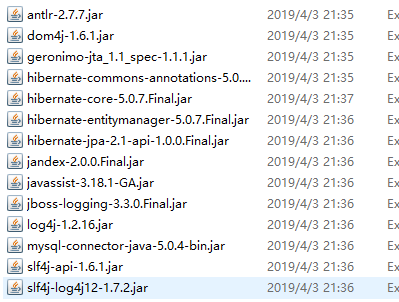

​	记得导入mysql包，同时因为使用hibernate时，有日志信息输出，hibernate本身没有记录日志的jar包，需要导入其他的jar包。

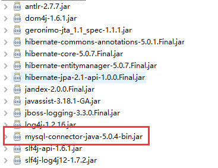

2. 第二步：创建实体类

   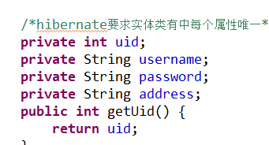

   >  使用hibernate时，不需要自己建立表

3. 第三步：配置实体类和数据库表一一对应关系（映射关系）

   1. 使用配置文件实现映射关系

      - 创建xml格式配置文件

        映射配置文件名称和位置没有固定位置要求

        >  建议：在实体类所在的包中创建，名称为：hbm.xml

      -  见到xml文件，引入xml约束。

        学过的约束dtd、scheme：在hibernate中引入dtd约束。

      

      ​	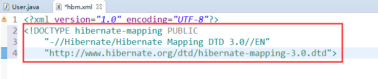

      - 配置映射关系

      ```java 
      <hibernate-mapping>
          <!--1. 配置实体类和表的映射
          	class标签
          	name属性：实体类的全路径
          	table属性：数据库表的名字
           -->
          	<class name="com.xxl.entity.User" table="t_user">
          	<!-- 2.配置实体类的id和表的主键id对应
          		id标签：
          		name：实体类中ID属性
          		column：数据库表中id字段名称（建议：字段名和实体类id同名）
          	 -->
          		<id name="uid" column="uid">
          			<!-- 生成数据库表id增长策略
          				native :生成表id值为自动增长。
          			 -->
          			<generator class="native"></generator>
          		</id>
          		<!--3. 配置其他属性和表的字段对应 
          			name属性：实体类的属性名
          			column属性：表的字段名
          		-->
          		<property name="username" column="username"></property>	
          		<property name="password" column="password"></property>
          		<property name="address" column="address"></property>
          	</class>
          </hibernate-mapping>
      ```

4. 第四步：创建hibernate的核心配置文件

   1. 核心配置文件格式xml，名称位置固定。

      - 位置：必须在src下
      - 名称：必须是hibernate.cfg.xml

      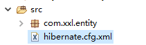

   2. 引入dtd约束

   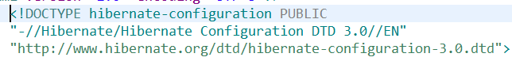

   3. hibernate操作中，只加载核心配置文件，其他配置文件不加载。

      - 第一部分：配置数据库信息（必须的）

      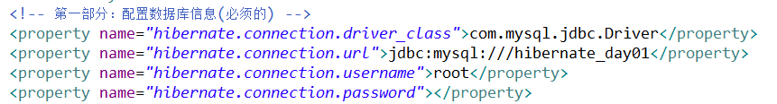

      - 第二部分：配置hibernate信息（可选的）

      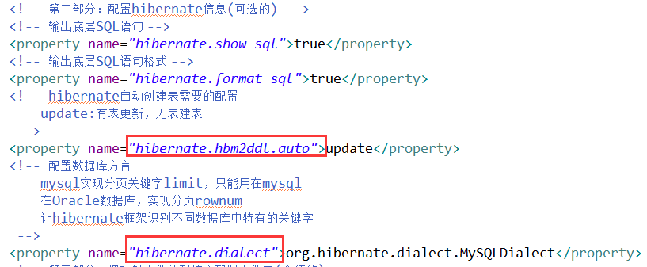

      - 第三部分：把映射文件放到核心配置文件中（必须的）

      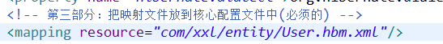

### 实现添加操作

1. 第一步：加载核心配置文件

2. 第二步：创建SessionFactory对象

3. 第三步：使用SessionFactory创建session对象

4. 第四步：开启事务

5. 第五步：写具体逻辑crud

6. 第六步：提交事务

7. 第七步：关闭资源

   ```java 
   @Test
   	public void testAdd() {
   //		1. 第一步：加载核心配置文件
   		//在src下找到名称为hibernate.cfg.xml
   		//在hibernate里面封装对象
   		Configuration cfg=new Configuration();
   		cfg.configure();		
   //		2. 第二步：创建SessionFactory对象
   		//读取hibernate核心配置，创建sessionfactory
   		//该过程根据配置，在数据库中创建表。
   		SessionFactory sessionFactory = cfg.buildSessionFactory();		
   //		3. 第三步：使用SessionFactory创建session对象
   		Session session = sessionFactory.openSession();
   //		4. 第四步：开启事务
   		Transaction beginTransaction = session.beginTransaction();
   //		5. 第五步：写具体逻辑crud
   		//添加功能
   		User user=new User();
   		user.setUsername("杨旭");
   		user.setPassword("123");
   		user.setAddress("甘肃天水");
   		//调用session方法添加
   		session.save(user);
   //		6. 第六步：提交事务
   		beginTransaction.commit();
   //		beginTransaction.rollback();
   //		7. 第七步：关闭资源
   		session.close();
   		sessionFactory.close();		
   	}
   ```

   

8. 看到效果：

   - 是否创建了表

   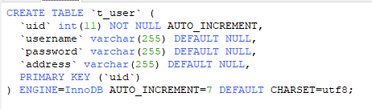

   - 表中是否有记录

   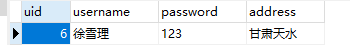

## Hibernate配置文件详解

### Hibernate映射配置文件

1. 名称、位置没有限定

2. 映射配置文件中，标签中name属性值写实体类相关的内容
   1. class的name属性值写实体类的全路径。
   2. id和property标签中的name属性值写对应实体类的成员变量名。

3. id标签和property标签中的column属性可以省略的。
   1. 不写默认取name属性值。

4. property标签type属性，设置生成表字段的类型，自动对应类型。

### Hibernate核心配置文件

1. 配置信息书写位置要求

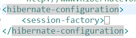

2. 配置三部分要求
   1. 数据库部分<font color=red>必须</font>
   2. hibernate部分可选
   3. 映射文件<font color=red>必须</font>
3. 核心配置文件固定
   1. 名称固定：hibernate.cfg.xml
   2. 位置固定：src下。

## Hibernate核心api

### Configuration

1. 代码

   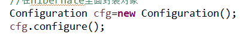

   - 创建Configuration对象，调用其configure()方法，自动在src目录下加载hibernate.cfg.xml配置文件。

### SessionFactory<font color=red>（重点）</font>

1. 使用configuration对象创建sessionFactory对象

   1. 创建sessionFactory过程中执行的操作

      1. 根据核心配置文件中的数据库配置、映射文件，到数据库中根据映射关系，自动创建表。

         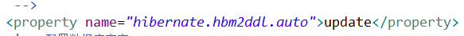、

         > 要自动创建表的必须配置

2. 创建sessionFactory过程中，非常消耗资源

   1. 在hibernate操作中，建议一个项目一个sessionFactory对象

3. 具体实现

   1. 编写工具类，写静态代码块实现

      > 静态代码块只在类被第一次创建时加载，以后不会再加载。

      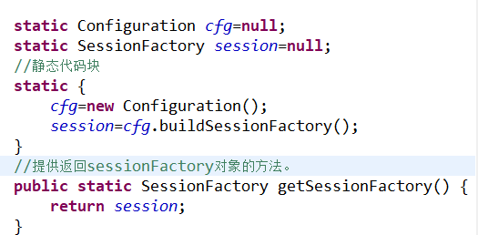

### Session（重点）

1. session类似于jdbc中的connection
2. 调用session里面的不同方法实现crud操作
   1. 添加save()
   2. 修改update()
   3. 删除delete()
   4. 根据id查询get()
3. session对象是单线程对象
   1. session对象为每个用户私有，不能共享。

### Tranction

1. 事务对象

   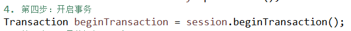

2. 事务中的提交和回滚

   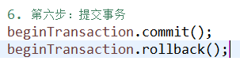

3. 事务概念

   1. 事务的四个特性

      原子性、一致性、隔离性、永久性

## 解决配置文件中没有提示问题

1. 可以上网

2. 将约束文件引入eclipse中。

   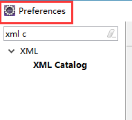

   - 在配置文件中复制一句话

     

     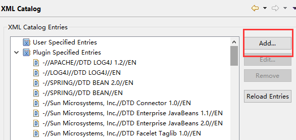

     

   - 重启eclipse