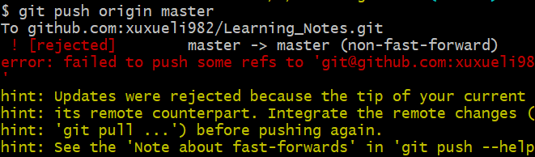
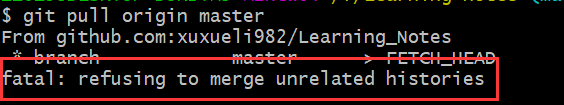
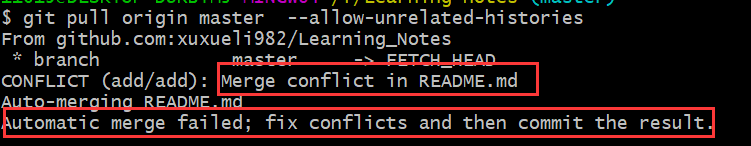
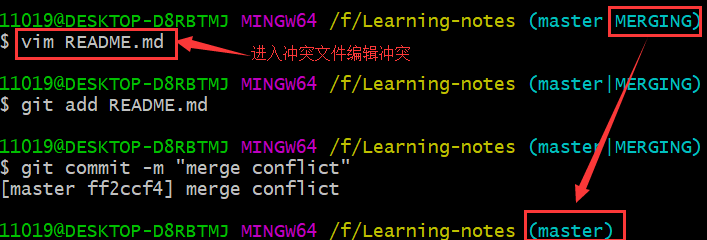
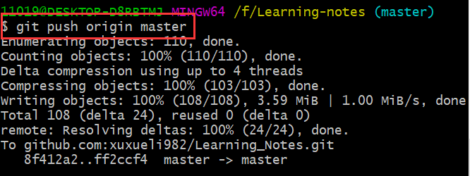

# GIT—NOTES

## 一、当前仓库和远程仓库建立连接的步骤

1. 添加远程仓库：`git remote add [仓库的别名] [仓库的地址]`
2. 拉取远程仓库的内容：`git pulll [仓库别名] [仓库分支]`
3. 处理拉取过程中的冲突；

### 连接中可能遇到的问题

1. 当前仓库没有与远程仓库建立联系时执行`git push [远程仓库别名][分支名]`指令。

   

2. 解决方法：

   - 拉取远程仓库：`git pull origin master`

     这时可能会报错：由于仓库的版本和本地仓库的版本可能同，因此他们之间不能合并；

     

   - 使用`git pull origin master --allow-unrelated-histories`可以合并不同的历史版本。

     

     > tips：在合并本地仓库和远程仓库时出现了冲突，这时提示我们要手动修改冲突。

   - 修改完冲突重新提交到远程仓库。

     

     

